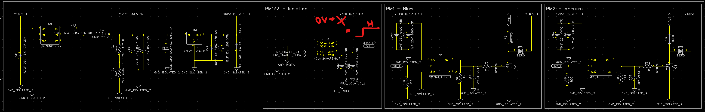
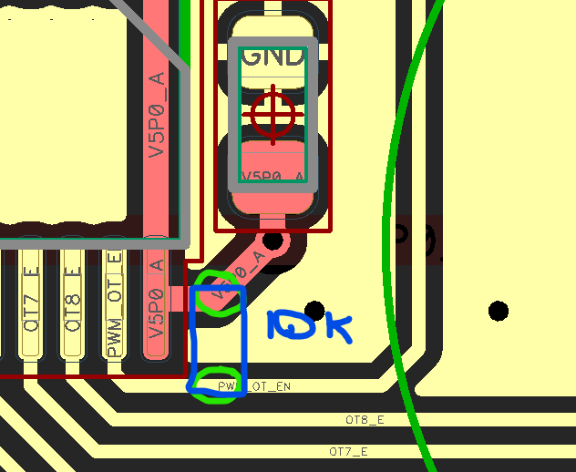
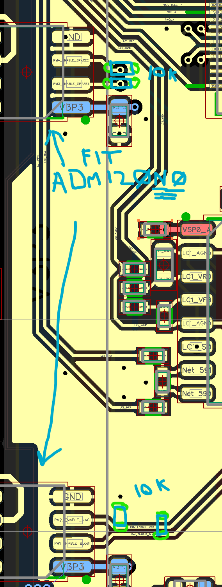
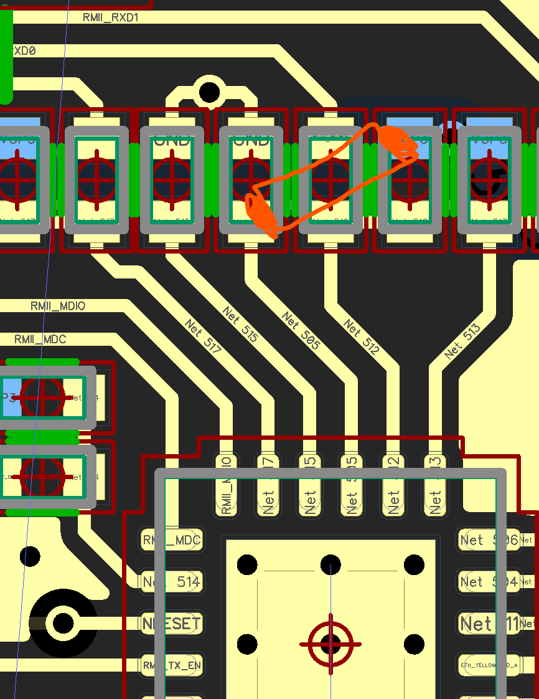
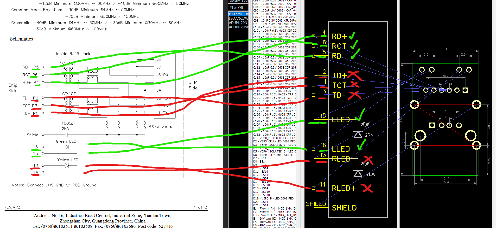
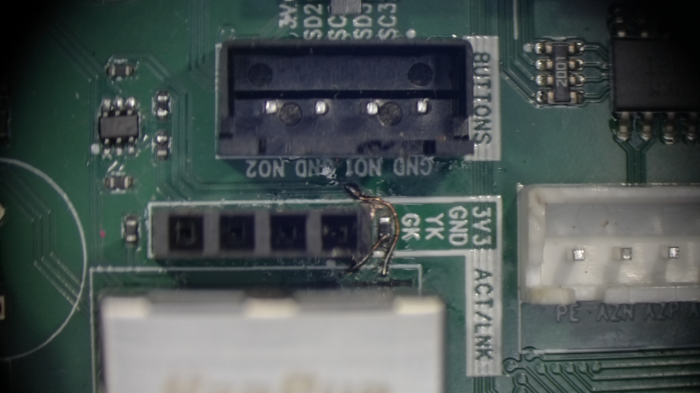
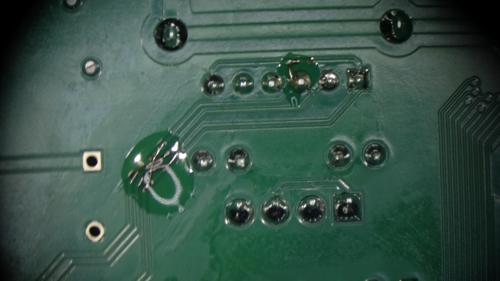
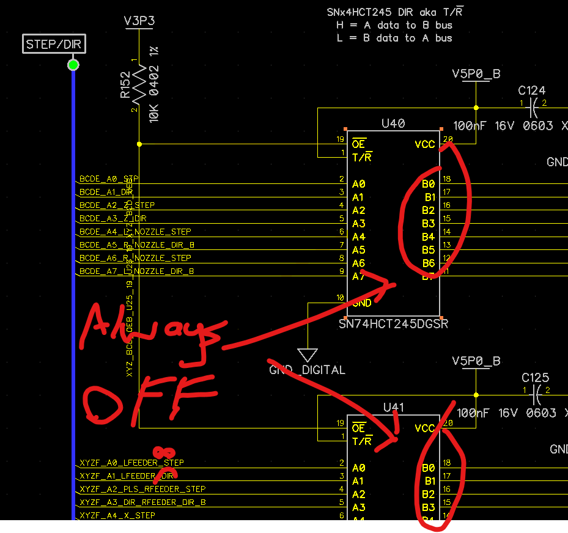
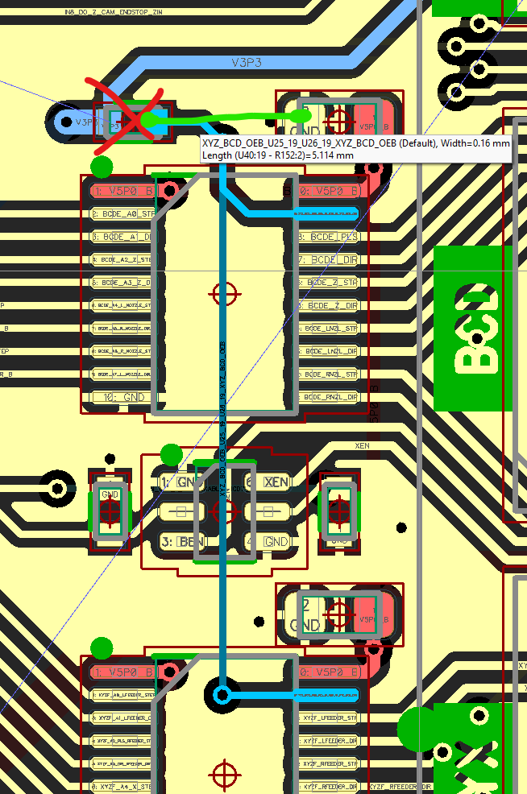

# Rev A1

## Errata

### issue with U5/U6 ideal diode ORing.  Apparently U6 is the primary.
### missing pull-up on U18 (SN74HCT245DGSR)

causes outputs to be undefined. observed that the PWM outputs are briefly enabled shortly
after bootup, but are then disabled shortly after.  Timing is undefined.

workaround-1: fit 10k pull-up to OE pin, see hack-1.

workaround-2: (partial) set the GPIO levels as soon as possible on bootup, but this requires running firmware 
so if a CPU is not installed, or a CPU is being firmware upgraded, the outputs will be undefined.

## PM1-4 outputs enabled if V3P3 is missing.

There is a power sequencing and failsafe issue with the PM1-4 outputs.  If the V3P3 rails are not present,
the PM1-4 outputs will be enabled.

The fail-safe output for the ADuM1200 is HIGH when VDDI is missing, this causes the corresponding PM1-4 output
to be enabled.



workaround-1: replace the ADuM1200 with an ADMuM120N0 or π120M30 which has a LOW fail-safe output, add 10k pull-downs on the PMx_ENABLE
signals.

## Missing VDDIO voltage on ETH

U20:9 was supposed to be connected to VDDIO, but was not.

## Hacks

### Hack 1

Missing pull-up on U18 (SN74HCT245DGSR)



### Hack 2

Fix PM1-4 fail-safe state.



### Hack 3

Fix VDDIO on ETH.

Install a 0R resistor or jumper wire between C75:1 and R68:2 *OR* C75:1 and 71:2.



### Hack 4

Incompatible RJ45 combo jacks fitted to 10 prototype PCBs.  They are extremely difficult to remove due to the amount of
pins and the heat dissipation of the PCB.  PCB pre-heater needed before attempting removal.  It's easy to swap the IO
signals of the RJ45 connectors, but the LEDs are more complicated to fix because the tracers are not easily accessible.

Even cutting the old connector of the board is extremely difficult due to the amount of
pins, shielding and plastic inside the mag-jacks.

Removal of the ACT/LNK header makes the top traces easier to cut and swap.





### Hack 5

Missing IO control of XYZ BCD EN signal.



workaround-1:

Set the OE pin to LOW to enable the level shifters.  Remove the 10k pull-up resistor on the OE pin and connect the OE
resistor pad to GND via a 10k pull-down.



# Rev B1

## Changes from Rev Ax

* Replace ADuM1200 with ADMuM120N0 to fix PM1-4 fail-safe state and power sequencing.
* Pull-downs on PM1-4 inputs (see ADMuM120N0 datasheet Rev F. Truth Table, Note 3.

 > Input pins (VIx) on the same side as an unpowered supply must be in a low state to avoid powering the device through the ESD protection circuitry


## TODO
[ ] use a single LM66200 instead of 2x LM66100, but ONLY if the chip handles ORing when both inputs are the same voltage for a long period.
[ ] add a pull-up to ~OE~ on U18 (SN74HCT245DGSR) to disable the device by default. without a core board attached the inputs are floating and undefined. See section 11.1 in the SN74HCT245DGSR datasheet.
[ ] fix missing VDDIO on U20:9
[ ] fix missing MCU/FPGA control of XYZ BCD EN signal.

## Investigations

### LM66100 ORing priority

Thursday, May 7, 2026 9:28 PM
```
commanderguy3001:
enabled if VIN > CE + 250mV
ST to GND if VIN < CE - 80mV

say both 3V3 rails come on at the same time.
U5:CE would be at 3.3V
U5:VIN is at 3.3V
so U5 is disabled
U5:ST is grounded
pulling U6:CE to ground, enabling it in "all" cases

commanderguy3001: yeah it's opposite to how they explain it in the DS.

say U5:VIN comes on first
U5:CE is at/near GND
enabling U5
making ST high-Z, so pulled up to U5:VIN
then let's make U6:VIN come on with the exact same voltage
since CE and VIN are the same on both chips, U5 stays enabled, and U6 stays disabled
now we add some noise to our inputs
at some point, U5:CE is gonna be more than 80mV below U5:VIN, disabling U5
this makes U5:ST go low
which turns on U6
```
