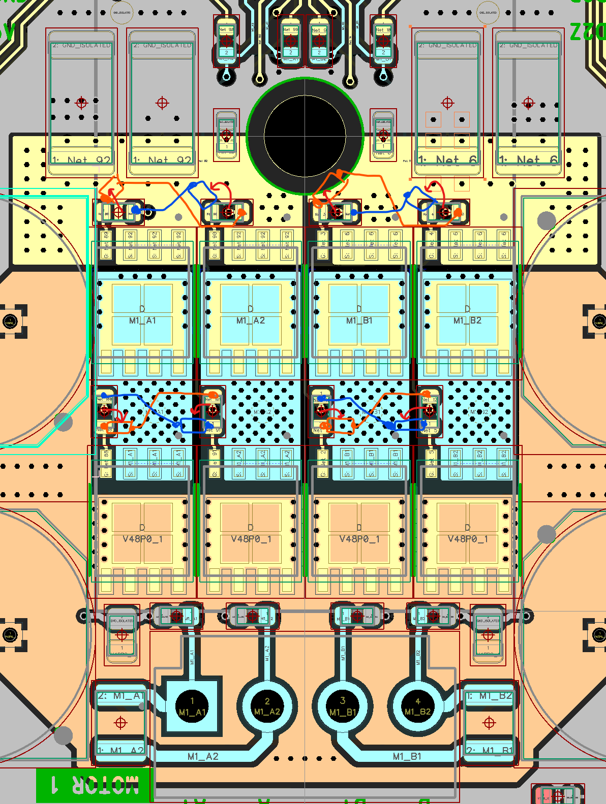
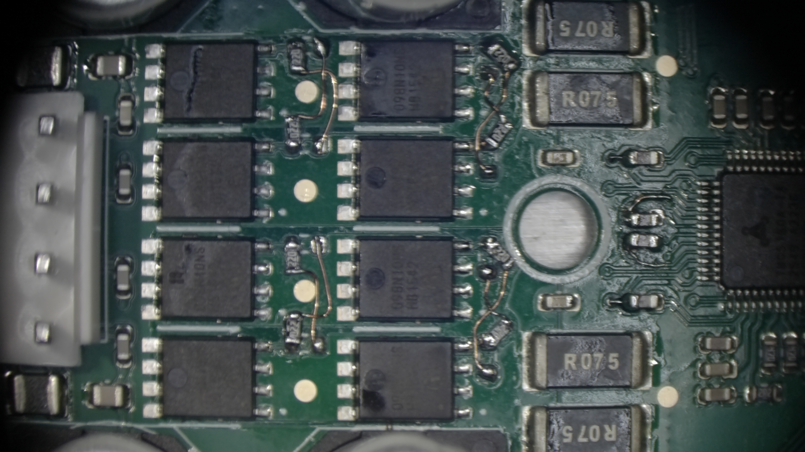

# Rev A1

## Errata

### Power sequencing on drivers
 
The drivers are not correctly disabled when stepper motor power is applied before the core / base board power.

#### Workaround

* Remove R31, set aside.
* Connect the removed R31 10k resistor between either:
  a) U7:12 (OUTD) WAKE_1 and U7:16 (VCC2) V5P0_IO.
  b) TP14 WAKE_1 and R51:1 V5P0_IO

### Transposed FET input/feedback signals

There is an issue with the FET input circuits not matching the feedback circuits, 1 -> 2 and 2 -> 1 instead of
1 -> 1 and 2 -> 2.

#### Workaround

Either swap the BMA1 with BMA2 and BMB1 with BMB2 or swap HA1 with HA2 and LA1 with LA2.

In practice, it's easier to do the latter, since the former requires cutting traces that are next to pads which is
more difficult.

Example rework

This need to be done for BOTH of the TMC5160.  So 16 jumper wires per board are required, but no trace cutting.

# Rev B1

## Changes from Rev A1

## TODO

### CRITICAL

[ ] Swap HA1 with HA2 and LA1 with LA2 to match the rework.
[ ] Move the DRV_ENN pull-up resistors to the opposite side of the signal isolators, so they are on the same side
    as the TMC drivers chips.
[ ] Ensure variant does not have the NO_PLACE components fitted (R25, R50, etc)
[ ] Fix E2 component, should be a 12V TVS diode, not 7V. Use MDD SMAJ12A (C113957) not SMAJ7.0A (C138782)
[ ] Add missing silk screen for motor pinouts nearest the edge connector.

### Would-be-nice

