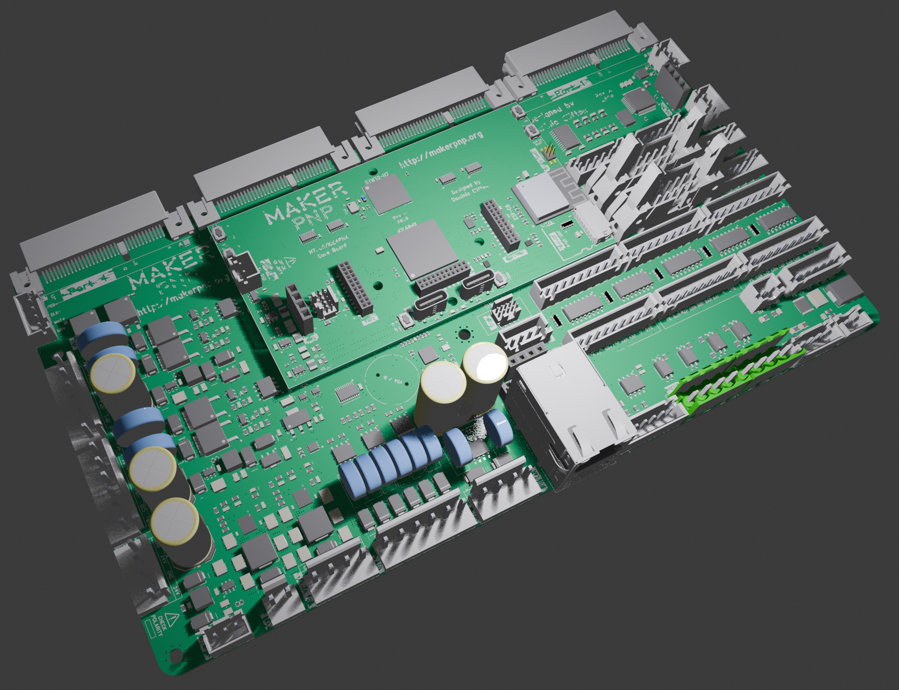

<div align="center">

[](https://discord.gg/ffwj5rKZuf)
[](https://www.youtube.com/channel/UClzmlBRrChCJCXkY2h9GhBQ?sub_confirmation=1)
[](https://github.com/MakerPnP)
[](https://ko-fi.com/dominicclifton)
[](https://www.patreon.com/MakerPnP)


</div>

# MakerPnP - Control Board

The system is designed to be a fully-featured, and expandable system for pick-and-place machines. Additionally, it is a
drop-in replacement for CHMT32/48 VA/VB machines and existing cables can be used without rewiring and uses the same
mounting holes.

The system can be used for new PnP machines, or retro fitted to existing ones.



The system is comprised of two main PCBs, called 'base' and 'core'. A 'core' has the processors and the 'base' has the
connectors for the machine, power-supply circuits, output drivers, protection circuits and other IO circuits and
connectors.  The base board also has expansion slots for things like stepper motor drivers.

The system will use the MakerPnP software and firmware, which is cross-platform and written in Rust. For further details
on the software refer to the following two source repositories:

* Planning software: https://github.com/MakerPnP/makerpnp
* Machine UI software and firmware: https://github.com/MakerPnP/machine

## User Features

* 6 A/B/Z (ABN) differential encoder inputs.
* 8 stepper motor transceiver-driven DIR/STEP signal pairs in 2 banks of 4.
* Emergency stop input on a dedicated hardware interrupt.
* 2x opto-coupled outputs.
* 2x opto-coupled inputs.
* Buzzer
* 8x 5V digital inputs. (end stops, etc)
* 2x 5V 6A regulators, 24V input.
* 5V output connector, e.g. for powering a Raspberry Pi 5.
* 7V output, e.g. for powering head-mounted devices.
* 8x 24V PWM controlled fused and flyback protected outputs.
* 2 pairs of two isolated 48V PWM capable fused and flyback protected outputs. (4x total). e.g. for pumps, heaters, etc.
* Load-cell amplifier.
* 10/100MBit Ethernet (in addition to the Wifi)
* RS422 for remote comms.
* Integrated 7 port USB hub.
* 2x FD-CAN 8Mbps ports.
* 2x I2C muxes and 2 port muxed I2C connector with 4 int signals. (great for identical sensors)
* 4x analog inputs (e.g. for Vacuum, Blow + 2 spare)
* Buttons on the CPU board, with break-out connectors on the main board.
* ETH link/activity LED break-out connector.
* USB connector.

## Expansion port system

The base board features 4x 64-pin expansion slots, each slot has enough signals for driving multiple stepper motors
per board, or for your other expansion ideas.

Each port has the following:
* 2 hardware UARTS.
* 1x SPI + 2x CS pins.
* 1x muxed I2C.
* 2x muxed analog inputs.
* 2x sets of ABN encoder signals. 
* 2x sets of DIAG0/DIAG1 signals.
* 2x 4 channel timers (e.g. for PWM, or 4x pairs of step/direction)
* Clock signals.
* Debug signals.
* Interrupt/Wake signals.
* Card insertion detection system.
* CAN H/L signals.
* USB port.
* 24V and 3.3V inputs.

Additionally, the base board as an RGB led physically located next to each port.

Expansion boards are planed for popular stepper motor drivers.

The slots are at the same physical height as the main board, due to the use of edge-mounted connectors.
Expansion slots can be combined. e.g. it is possible to design a board that plugs into 1,2,3 or 4 ports at the same time.
Note: For high-current expansion boards, it's advised to use power connectors on the expansion board itself.

## Expansion header system

The CPU board features 3 expansion sockets, to allow the connection of expansion cards or debug/development equipment
such as:

* 16 channel logic analyzer (via 16 dedicated FPGA pins).
* additional memory.
* additional sensors.
* other peripherals.

## Developer features

* The cpu/core board expansion headers also allow FPGA flash programming, ESP-C6 programming, H7 programming.
* Debug headers and ports (SWD).
* Boot buttons for H7 and C6.
* Cold-boot select buttons for the FPGA.

## Technical features

* 2 PCB system, a base board and a core board.
* STM32H725IG 550Mhz CPU, 1MB Flash, 564KB RAM (176+25 pin BGA)
* ICE40HX8K FPGA, 7680 logic cells, 128kbit RAM (256 pin BGA)
* ESP32-C6 module, 160Mhz, 4MB Flash, 512KB RAM, Wifi-6, RISC-V, BT 5 LE
* 16MBit shared flash.
* Base board uses 2oz copper 4L PCB.
* Core board used 1oz copper 6L PCB.
* Dedicated 4-bit hardware bus between H7 and FPGA. (OctoSPI1)
* Second 4-bit hardware bus between H7, FPGA, C6 and shared flash.  (OctoSPI2) 

The goal is to make accessing the FPGA and C6 from the H7 seamless by memory mapping them into the H7's address space
using OctoSPI, thus making it possible to send data to/from the FPGA and C6 without a complicated communication protocol.

## Firmware

Firmware is work-in-progress, join the MakerPnP discord server to find out the latest information!

## Status

This status is updated periodically, visit the discord server for the latest information.

### Status overview

| Functionality                       | Status                                                                                  |
|-------------------------------------|-----------------------------------------------------------------------------------------|
| Base board main VRegs               | ✅ - Working                                                                             |
| Core board main VRegs               | ✅ - Working                                                                             |
| Base board to Core board connectors | 🚧 - Fit is perfect, not all IO lines tested yet                                        |
| H7 Programming Port                 | ✅ - Working                                                                             |
| H7 DFU button                       | ✅ - Working                                                                             |
| C6 Enable button                    | ✅ - Working                                                                             |
| C6 Boot button                      | ✅ - Working                                                                             |
| C6 UART Pads                        | ✅ - Working                                                                             |
| C6 Activity LED                     | ✅ - Working, blinky test code flashed via USB port and blinks LEDs                      |
| STM32H735                           | 🚧 - Not all IO lines tested yet                                                        |
| ICE40HX8K                           | 🚧 - Not all IO lines tested yet                                                        |
| ESP32-C6                            | 🚧 - Not all IO lines tested yet                                                        |
| USB hub                             | ✅ - Detected in Windows, H7 DFU + C6 JTAG working                                       |
| Base board USB sockets              | ✅ - Main up-stream socket working, spare hub USB port working                           |                                  
| Core board cable bus switches       | ✅ - Working, cable works when connected, usb by hub works when cable disconnected       |
| Flash                               | 🚧 - Works with H7 and FPGA, C6 connection untested                                     |
| Ethernet                            | ✅ - Working well with Embassy-net/SMOL                                                  |
| Logic Analyzer Port                 | ✅ - All 16 IO signals working                                                           |
| Digital IO (DIN1-8)                 | ✅ - Working                                                                             |
| Buttons                             | 🚧 - Working, but FPGA cold-boot selection not tested                                   |
| LEDs (2x Activity)                  | ✅ - Working                                                                             |
| Buzzer                              | ✅ - Working                                                                             |
| Expansion Ports                     | 🚧 - Port 1 SPI + Wake + CLK + Step1/Dir1 (via mux) working                             |
| Expansion card detection circuit    | ✅ - Working                                                                             |
| Base board detection circuit        | ✅ - Working                                                                             |
| Timer Muxes                         | ✅ - Working, signals from FPGA or MCU can be selected                                   |
| Master Reset button                 | ✅ - Working, powers off Core board regs when pressed                                    |
| TMC5160 Stepper Motor               | 🚧 - TMC5160 spins motors, external encoders inputs not tested yet.                     |
| Base board encoder sockets          | ✅ - Working, tested with a 17HS24-2004-ME1K NEMA 17 stepper motor with encoder          |
| Emergency stop input                | ✅ - Working                                                                             |
| Base board WS2812 LEDs              | ✅ - Working                                                                             |
| Base board WS2812 external LEDs     | ✅ - Working                                                                             |
| PWM outputs OT1-8                   | 🚧 - Circuits tested without Core board attached, not tried via MCU yet                 |
| PWM outputs PM1-4                   | 🚧 - Circuits tested without Core board attached, not tried via MCU yet                 |
| BCDE/XYZF outputs                   | ✅ - Working, 8-motor stepper control with sequence based ramp/cruise and pause support  |
| Analog In (AIN_VAC/AIN_EXT)         | ✅ - Working                                                                             |
| Analog In Mux (expansion ports 1-4) | ✅ - Working                                                                             |
| DDIF socket                         | 🚧 - Not tested, but IC that signals are routed through is working, since encoders work |
| Optical I/O                         | ✅ - Working. Using 5V supply and 1k0 to GND via buttons for inputs.                     |
| EXP1 port                           | 🚧 - Not all IO lines tested yet                                                        |
| EXP2 port                           | 🟦 - Not tested                                                                         |
| External Link/Activity LED socket   | 🟦 - Not tested                                                                         |
| External buttons socket             | 🟦 - Not tested                                                                         |
| I2C muxes                           | 🟦 - Not tested                                                                         |
| External I2C socket                 | 🟦 - Not tested                                                                         |
| Pressure sensors                    | 🟦 - Not tested, not fitted                                                             |
| HX717 load cell sensor              | 🟦 - Not tested                                                                         |
| Wifi                                | 🟦 - Not tested                                                                         |
| SDCard                              | 🟦 - Not tested                                                                         |
| CAN 1                               | 🟦 - Not tested                                                                         |
| CAN 2                               | 🟦 - Not tested                                                                         |
| RS422                               | 🟦 - Not tested                                                                         |

### Status log

2026/06/23
 - Much IO is verified and working, code is being written for the FPGA and MCU to validate the hardware.
 - Memory mapped OctoSPI between H7 and FPGA is working well.
 - Stepper motor drivers are working well.

2026/05/30
 - Verification of the hardware is well underway.
 - Errata and Revision history files have been created.

2026/05/06
 - The base, core and stepper1 boards were delivered.

2026/03/13
 - An order for a very small batch of the base board has been placed.
 - the ICE40HX caBGA256 are in short supply, suppliers have 40 week lead times, an order has been placed for a small 
   quantity before suppliers run out.
 - An order for a small batch of the core boards will be placed ASAP.


## Manufacturing files

Refer to PCB Revision History / Errata files before using any files here.

The repo contains files that can be used for manufacturing, however do NOT use any files for manufacturing
PCBs.  Files in the repo are only good for manufacturing when they have been tagged with a git commit that says
'Release To Manufacturing' (RTM).  This is because commits to this repo may make changes to the schematic without
updating the PCB, changes the the PCB without re-exporting gerber or placement files and so on.  Also, there is a lag
between when files are used for manufacturing and when testing and validation is performed.

Example tags that were used for the first round of manufacturing:
```
RTM-MakerPnPBase-RevA-20260313-0241
RTM-MakerPnPCore-RevA-20260313-0242
RTM-MakerPnPCore-RevA-20260405-0022
RTM-MakerPnPStepper1-RevA-20260327-1304
RTM-MakerPnPStepper1-RevA-20260330-0052
```


## Building BOM variants

The MakerPnP `variantbuilder_cli` tool is used to take the exported DipTrace PnP files, along with the parts,
substitutions, and part mapping files, to produce PnP files that use actual parts that can be ordered and placed.

e.g. the schematic might say `CAP_0402`, and `100nF 6.3V 0402`, but additional information is added by substitution rules and
part mappings in order to end up with this:

```
├── C1 (name: 'CAP_0402', value: '100nF 6.3V 0402')
│   └── Substituted (name: 'CAP_0402', value: '100nF 6.3V 0402 X7R 10%'), by (name_pattern: 'CAP_0402', value_pattern: '100nF 6.3V 0402'), comment: 'Use X7R 10% by default'
│       └── Substituted (name: 'CAP_0402', value: '100nF 16V 0402 X7R 10%'), by (name_pattern: 'CAP_0402', value_pattern: '100nF 6.3V 0402 X7R 10%'), de-rate: 'from 6.3V to 16V'
│           └── manufacturer: 'Samsung Electro-Mechanics', mpn: 'CL05B104KO5NNNC' (Auto-selected)
```

Here's how the tools are can be run (from their corresponding directories):
```
$ variantbuilder_cli @MakerPnPControl-core-PnP_variant1.args
$ variantbuilder_cli @MakerPnPControl-PnP_variant1.args
```

Note: the arguments are contained within the `.args` files for easy editing and maintainability.

## Links

Please subscribe to be notified of live-stream events so you can follow the development process.

* Patreon: https://www.patreon.com/MakerPnP
* Source: https://github.com/MakerPnP
* Discord: https://discord.gg/ffwj5rKZuf
* YouTube: https://www.youtube.com/@MakerPnP
* X/Twitter: https://x.com/MakerPicknPlace

## Authors

* Dominic Clifton - Project founder and primary maintainer.

## License

CC-BY-NC - https://creativecommons.org/licenses/by-nc/4.0/

## Contributing

If you'd like to contribute, please raise an issue or a PR on the github issue tracker, work-in-progress PRs are fine
to let us know you're working on something, and/or visit the discord server.  See the  section above.
